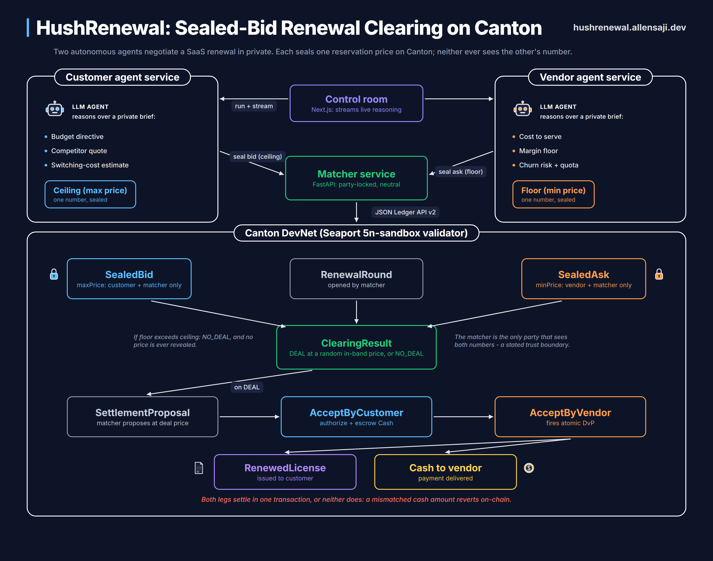

<p align="center">
  
</p>

<h1 align="center">HushRenewal</h1>

<p align="center">
  Autonomous agents negotiate SaaS renewals in private: sealed-bid clearing and atomic settlement on Canton.
</p>

<p align="center">
  <a href="https://hushrenewal.allensaji.dev/demo"></a>
  <a href="https://youtu.be/RnhlsxYg_q4"></a>
  <a href="https://hushrenewal.allensaji.dev"></a>
  
</p>

<p align="center">
  <a href="https://hushrenewal.allensaji.dev/demo"><b>Live demo</b></a> |
  <a href="https://youtu.be/RnhlsxYg_q4"><b>Demo video</b></a> |
  <a href="#architecture">Architecture</a> |
  <a href="#privacy-model">Privacy model</a> |
  <a href="#running-locally">Run locally</a>
</p>

---

## Demo video

Two minutes: the problem, why Canton, and a full live round (agents reason
and seal, random-in-band clearing, atomic settlement, adversarial probes).

<p align="center">
  <a href="https://youtu.be/RnhlsxYg_q4">
    
  </a>
</p>

## The problem

Enterprise SaaS contracts are negotiated, not list-priced, and they step up
sharply at renewal. The negotiation is information-broken: the customer will
not reveal its budget ceiling (that kills its leverage) and the vendor will
not reveal its price floor (that kills its margin). Renewals become slow,
deadline-driven back-and-forth that settles badly, or auto-rolls into another
year at a worse rate when a notice window is missed.

## What HushRenewal does

Two autonomous agents negotiate the renewal, and neither side ever sees the
other's number.

1. A neutral matcher opens a renewal round on Canton.
2. The customer agent and the vendor agent each reason over a private brief
   (budget, competitor quote, switching cost on one side; cost to serve,
   margin floor, churn risk on the other) and commit to one reservation
   price. The reasoning streams live; the briefs share no fields.
3. Each agent seals its number on the ledger: the customer's ceiling in a
   `SealedBid`, the vendor's floor in a `SealedAsk`. Each sealed contract is
   visible only to its submitter and the matcher.
4. The matcher clears the overlap. If the floor is at or below the ceiling,
   it draws a price at random inside the band (the contract asserts band
   membership on-chain), so the outcome never reveals either reservation
   price. Otherwise the result is NO_DEAL and nothing quantitative leaks.
5. On a deal, the agents settle it themselves: the matcher proposes, the
   customer agent authorizes and escrows the cash, the vendor agent accepts,
   and the renewed license and the payment execute in one atomic
   delivery-versus-payment transaction. Both legs, or neither.

Every step is a live transaction on a real Canton validator.

## Live demo

The full flow runs at
[hushrenewal.allensaji.dev/demo](https://hushrenewal.allensaji.dev/demo)
against Canton DevNet. Things worth trying:

- Expand "what this agent can see" on either agent: each panel is served by
  that agent's own `/context` endpoint and contains zero fields from the
  other side.
- Switch the ledger projection between customer, vendor, and matcher, and
  toggle the raw JSON view: the vendor's view never contains `maxPrice`, the
  customer's never contains `minPrice`.
- Run the adversarial probes. "Attempt peek" has the vendor query the ledger
  for the customer's sealed bid and get nothing back, while the matcher
  proves the bid exists. "Force bad settle" escrows a mismatched cash amount
  and the settlement reverts on-chain, so no paid-but-not-renewed state is
  reachable.
- Run the no-overlap scenario: a failed negotiation reveals no price at all.

A faked demo would pass none of these; they run against the live ledger.

## Architecture



| Component | What it is | Where it runs |
|---|---|---|
| `daml/` | Contract layer: rounds, sealed bids/asks, clearing, settlement handshake, atomic DvP | Canton DevNet (Seaport 5n-sandbox validator) |
| `backend/` | Matcher service (FastAPI). Party-locked ledger clients over the JSON Ledger API v2, OIDC auto-refresh, random-in-band price draw | Render |
| `agents/` | Two isolated LLM agent services, one process per role. Reason over a private brief, stream reasoning via SSE, seal through the backend's party endpoints | Render (two services) |
| `web/` | Control room UI (Next.js). Streams agent reasoning, renders per-party ledger projections, drives the adversarial probes | Vercel |

The two agent services share a codebase but run as separate deployments with
separate credentials, so context isolation is a deployment fact rather than a
convention. The matcher stays deterministic; it is not an LLM.

## Privacy model

Daml signatories and observers decide who stores and sees each contract.
The whole design leans on that:

| Contract | Who can see it |
|---|---|
| `RenewalRound` | matcher, customer, vendor |
| `SealedBid` (customer ceiling) | customer + matcher only |
| `SealedAsk` (vendor floor) | vendor + matcher only |
| `ClearingResult` | all three; carries a price only on DEAL |
| `SettlementProposal` chain | the parties as they join the handshake |
| `RenewedLicense` + `Cash` | their stakeholders |

Two properties fall out of this:

- A single shared contract holding both numbers would leak (signatories see
  the whole payload), so each number lives in its own sealed contract with
  the matcher as the only common stakeholder.
- The clearing price is drawn at random inside the band, not at the
  midpoint. A midpoint price plus your own bound solves for the counterparty's
  exact number; a random draw does not.

The stated trust boundary: the matcher does see both raw numbers. That is
honest and explicit, the same position a clearing house holds in traditional
markets. Moving the comparison into ZK or MPC is future work.

## On-chain footprint

| | |
|---|---|
| Validator | Seaport 5n-sandbox, Canton DevNet |
| Package | `0dade8d4eca19b8ce331b6d82d08ae6054f00af0ae893112a4c06c94d7526e18` |
| Matcher party | `hushrenewal-matcher-1::1220a14ca128063b8dc9d1ebb0bd22633be9f2168500f4dbc1ecaeb1855b14e5acf8` |
| Customer party | `hushrenewal-customer-1::1220a14c...acf8` (same namespace) |
| Vendor party | `hushrenewal-vendor-1::1220a14c...acf8` (same namespace) |

Note for reviewers browsing the Seaport UI: it logs in as the shared org
party, which is not a stakeholder on any HushRenewal contract, so by Canton's
privacy model these contracts are invisible there. Query the ledger as one of
the three parties above (the demo's ledger projection does exactly this) and
they appear.

## Repository layout

```
daml/       Contract layer (Daml SDK 3.4.11)
backend/    Matcher service (FastAPI, uv)
agents/     Negotiation agent services (FastAPI, uv), one process per role
web/        Landing page + control room demo (Next.js)
docs/       Architecture diagram, logo
render.yaml Render blueprint: backend + both agent services
```

Each service directory has its own README with full detail.

## Running locally

Prerequisites: `uv`, Node 20+, and credentials for a Canton validator
(the deployed instance uses Encode-provisioned Seaport DevNet credentials;
without them the backend has no ledger to talk to).

Backend:

```bash
cd backend
uv sync
cp .env.example .env    # fill in the CANTON_DEVNET_* credentials
uv run uvicorn hushrenewal.main:app --port 8000
```

Agents (two processes, one per role):

```bash
cd agents
uv sync
cp .env.example .env    # set GROQ_API_KEY

AGENT_ROLE=customer BACKEND_URL=http://127.0.0.1:8000 \
  uv run uvicorn negotiator.main:app --port 8100

AGENT_ROLE=vendor BACKEND_URL=http://127.0.0.1:8000 \
  uv run uvicorn negotiator.main:app --port 8200
```

Web:

```bash
cd web
npm install
npm run dev             # http://localhost:3000/demo
```

The web app defaults to `localhost:8000/8100/8200`, so local dev needs no
extra configuration. For a deployed build, set `NEXT_PUBLIC_API_URL`,
`NEXT_PUBLIC_CUSTOMER_AGENT_URL`, and `NEXT_PUBLIC_VENDOR_AGENT_URL` at build
time.

Contracts:

```bash
cd daml
daml build             # produces the DAR uploaded to the validator
```

## Deployment

- `render.yaml` is a Render blueprint for all three Python services. Secrets
  (`CANTON_DEVNET_*`, `GROQ_API_KEY`, `BACKEND_URL`) are pasted in the
  dashboard, never committed.
- The web app deploys to Vercel with the three service URLs baked at build
  time.
- A scheduled GitHub Action pings each service's `/health` every 10 minutes
  so free-tier instances stay warm.

## Honest limitations

- All three parties are hosted on one shared DevNet participant, so isolation
  is enforced by Daml's privacy model plus the service and credential split,
  not by separate participant nodes. The visibility guarantees are identical;
  a production deployment would put each party on its own participant.
- The cash leg is a mock token, standing in for a real Canton Coin DvP.
- The SaaS briefs are illustrative data, standing in for real procurement and
  CRM inputs.

## Team

Built for the Encode Build on Canton hackathon, Track 3 (Payments, Neo
Banking and Agentic Commerce).

- Melissa Akinyi: Daml contract layer
- Allen Saji ([allensaji.dev](https://allensaji.dev)): architecture, matcher
  backend, agent services, web, deployment
